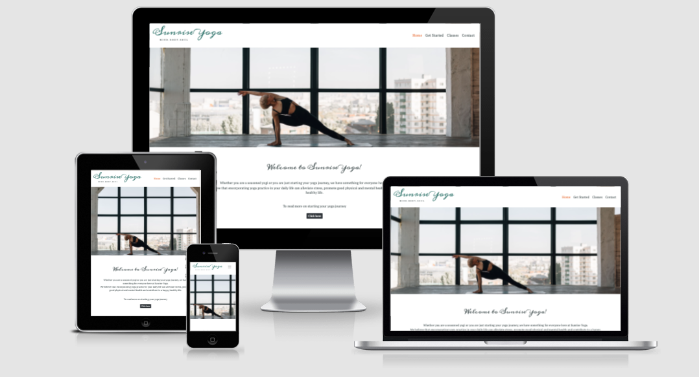
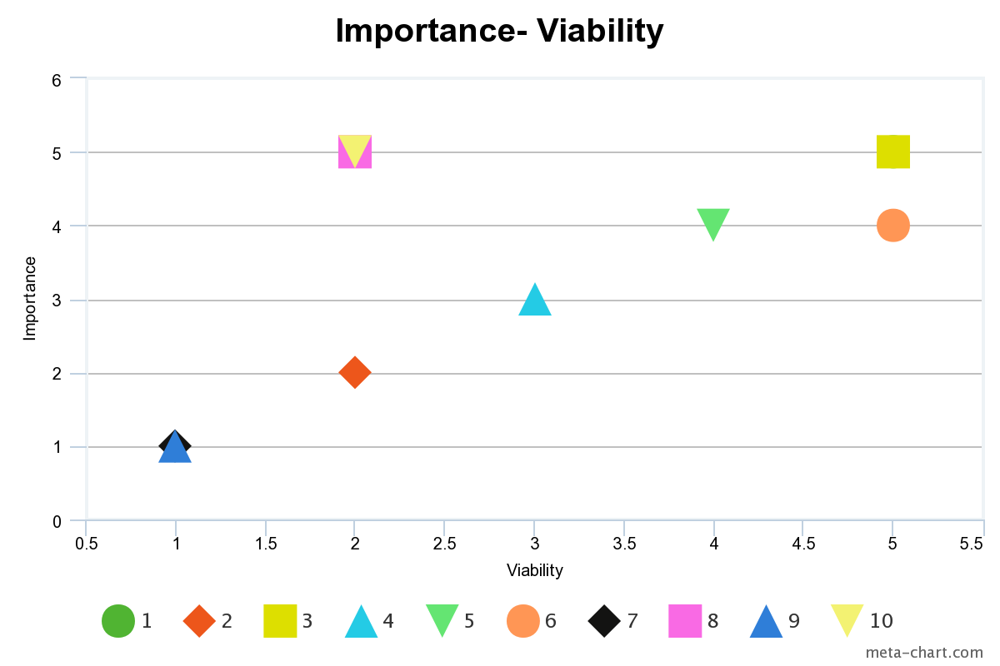
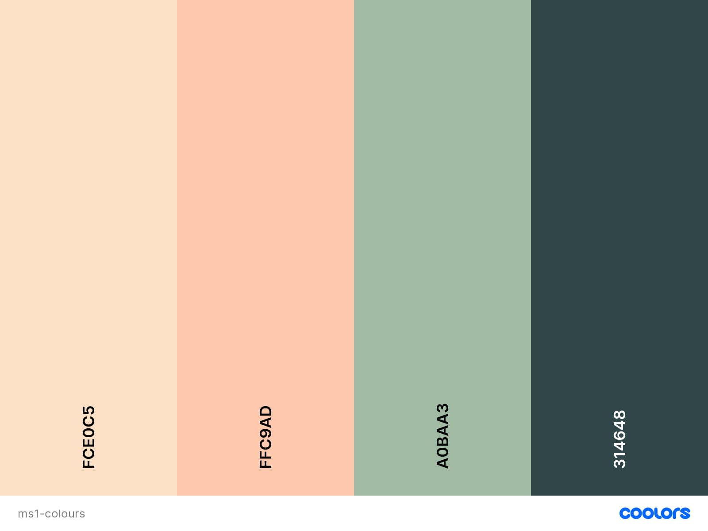

# Sunrise Yoga
---

Sunrise Yoga is a mobile-first website that aims to positively promote yoga, its benefits and encourage visitors to uptake classes at the studio. Yoga has been practiced for over 5,000 years and continues to bring strength, balance and inner peace to people and communities today. Regular yoga practice can not only help manage stress and anxiety, it can help regulate hormones, reduce blood pressure, improve cardio fitness, balance and coordination, among other benefits. 

This website has been designed to ensure that visitors feel a sense of peace, balance and growth when exploring the site. Visitors can find information on the benefits of yoga, yoga styles available, studio times, location and contact information. The primary goal of the site is to promote the studio and increase attendance at classes.

This website has been created for my Milestone 1 User Centric Frontend Development Project for Code Institute. 

[View the live site here](https://anyahush.github.io/sunrise-yoga/)

---

## Table of Contents

1. [ Project Goals](https://github.com/anyahush/sunrise-yoga#project-goals)
2. [UX](https://github.com/anyahush/sunrise-yoga#ux)
    1. [ Strategy PLane](https://github.com/anyahush/sunrise-yoga#strategy-plane)
        * [ User Stories ](https://github.com/anyahush/sunrise-yoga#user-stories)
    2. [ Scope Place](https://github.com/anyahush/sunrise-yoga#scope-plane)
        * [ Existing Features](https://github.com/anyahush/sunrise-yoga#existing-features)
        * [ Features left to implement](https://github.com/anyahush/sunrise-yoga#features-left-to-implement)
    3. [ Structure Plane](https://github.com/anyahush/sunrise-yoga#structure-plane)
    4. [ Skeleton Plane](https://github.com/anyahush/sunrise-yoga#skeleton-plane)
    5. [ Surface Plane](https://github.com/anyahush/sunrise-yoga#surface-plane)
3. [ Technologies](https://github.com/anyahush/sunrise-yoga#technologies)
4. [ Testing](testing.md)
5. [Deployment](https://github.com/anyahush/sunrise-yoga#deployment)
6. [Credits](https://github.com/anyahush/sunrise-yoga#credits)
7. [Acknowledgements]()

---

## Project Goals

* To establish an online presence for Sunrise Yoga.
* To enable easy access to required information throughout the site.
* To promote available classes.
* To provide a means of engagement for current and prospective users. 
* To provide content on yoga, styles available and practical information. 

---

## UX

## Strategy Plane

### Client Goals
* As a client, I want a website developed, so I can increase brand awareness of the studio.
* As a client, I want to establish a well designed platform, so I can engage with users about yoga.
* As a client, I want my users to navigate easily through the site, so they have a good user experience and return to the site.
* As a client, I want visuals and information to be displayed clearly and concisely, so that users want to attend yoga classes at the studio.

### User Stories

* First-time visitors
    * As a first-time visitor, I want to understand what the site is about and who it is for. 
    * As a first-time visitor, I want to be able to find information about yoga and the styles available, so I can decide if I want to attend. 
   

* All visitors
    * As visitor, I want to be able to navigate the site easily, so I can find the information I seek. 
    * As a visitor, I want to be able to check up-to-date class information, so I can find the right class for me.
    * As a visitor, I want to be able to contact the studio, so I can have my queries resolved. 
    * As a visitor, I want to be able to sign up for a newsletter, so I can stay informed about the studio.
    * As a visitor, I want to be able to find social media links, so I can continue to follow the studio.
    * As a visitor, I want to see images of the studio and classes, so I am encouraged to attend.
    * As a visitor, I want to know the location of the studio, so I can easily find it when I attend.

&nbsp;

### Opportunity Goal Table

During the initial strategy planning, the opportunities of the site were determined and values were given according to their imporance and viability at this stage.

| Opportunity | Importance | Viability |
| ----------- | ---------- | --------- |
| 1. Create an online presence | 5 | 5 |
| 2. Increase social media following | 2 | 2 |
| 3. Promote available classes | 5 | 5 |
| 4. Promote uptake of newsletter | 3 | 4 |
| 5. Encourage user contact | 4 | 4 |
| 6. Provide contact information and map location | 5 | 4 |
| 7. Online booking system | 2 | 1 |
| 8. Testimonial page | 2 | 5 |
| 9. Online membership platform | 1 | 1 |
| 10. Events page | 2 | 5 |

&nbsp;

*Note: Number 1: Create an online presence is plotted at 5,5, behind number 3.*

&nbsp;

## Scope Plane

During the strategy stage features were mapped according to their importance and viability. This process helped to ensure the project didn't extend beyond it's immediate scope.  As a result, each feature has been categorised for current and future releases. The table below highlights which release each feature falls into. 

| Opportunity | Release | 
| ----------- | ---------- | 
| Create an online presence | 1|
| Increase social media following | 2 |
|  Promote available classes | 1 |
| Promote uptake of newsletter | 1 |
| Encourage user contact | 1| 
| Provide contact information and map location | 1|
| Online booking system | 3 | 
| Testimonial page | 2 |
| Online membership platform | 3|
| Events page | 2 | 

&nbsp;

### **Existing Features**

- Mobile-first Responsive Design

    * This website has been developed with mobile-first design at the centre of the process. To ensure that users can easily, efficiently and enjoyable use the website across different devices, the design and features have been adapted accordingly, using Bootstrap framework and CSS styling.

- Navigation Bar

    * The navigation menu is featured across all pages and remains at the top of the page throughout. This ensures the user doesn't have to scroll to the top return to the menu options. Users can see the different page options at all times, with the page they are currently viewing emphasised. 
    * By having the navigation bar at the top of every page ensures that the user can find what they are looking for quickly, creating a good user experience. On smaller screens the navigation bar is collapsed, but remains in the top right hand corner. 

- Landing Page

    * The landing page introduces the user to Sunrise Yoga. It features a hero image of a woman practicing yoga. This is a striking image, that quickly indicates to the user that the website is related to yoga. Additionally, there is a welcome message that introduces the user to site. The welcome message also includes a button that links to the Get Started page, where new users can find out more about starting yoga. 

- Our Ethos Section

    * The Our Ethos section describes to the user about the ethos, values and history of the studio. This builds a strong brand for the studio and trust with the users. By giving the users context of the studio, it encourages users to further explore the website and book classes at the studio.

- Newsletter Sign-Up

    * On the landing page there is a sign-up form where users can input there details and  in return will receive a monthly newsletter containing further information and news about the studio. 

- Gallery

    * At the bottom of the landing page there is a gallery. These images are a mixture of people practicing yoga and of the studio. The images convey to users what it would be like if they attended and what yoga can look like. By showing users what the classes will look like, it encourages users to attend as it de-mystifies some of the worries about starting yoga or a new class. 

- Footer

    * The footer of the website remains the same throughout the site. This continuity ensures that the user can find what they are looking for quickly, creating a good user experience. The footer contains [Font Awesome](https://fontawesome.com/) icons for social media links to the studio's social media accounts. These sites open on a seperate page when clicked. By having social media links easily accessible throughout the site means that users can continue to follow the studio.

- Get Started Page

    * The second page is called Get Started and it specifically targets people who haven't done yoga before or haven't done it in a long time. This page includes information on starting yoga and what beginner options are available, along with supporting images. Having this dedicated page on starting yoga, allows new users to navigate the site easily.

- Class Timetable

    * A table is used to display the class timetable. This has been amended to accordion style for smaller screens, so that users are not required to use a horizontal scroll. The class days, times and levels are shown, so users can decide what class they would like to attend. Information on the different styles available, cost and what to bring is also included to ensure that the user if fully informed.

- Location Information 

    * On the final page the location information of the studio and map are dislayed. The map helps users to visually understand where the studio is. The map can also be clicked on and enlarged. The supporting information tells users about parking and transport options. This practical information is important in ensuring the user is fully informed.

- Contact Form

    * The contact form allows users to contact the studio regarding any questions, queries or issues. The form allows users to personalise the message, rather than predetermined options. The studio contact information is also provided incase a user would prefer to directly call or email the studio.

### **Features Left to Implement**

- Events Page

    * An events page will showcase what events and retreats are available. This allows users to explore other options to engage with the studio outwith the yoga classes. The events page would describe what is available, dates, price and an option to book.

- Testimonial Page

    * A testimonial page will be dedicated to highlighting positive feedback of members and studio users. This page is important for encouraging new and existing users to attend and engage with the studio. Positive stories and anecdotes help users understand the impact the studio and yoga has had on people.

- Online Booking System

    * An online booking system will allow the studio the manage attendees and bookings in advance of classes. It will also enable users to pre-book classes, so they can ensure they have a space.

- Online Membership Platform

    * An online membership platform will allow the studio to expand what it can offer to users throught membership bundles, discounts and early-bird offers. For users, an online membership platform enables them to manage bookings, view their class history and access discounts and offers.

## Structure Plane

This site has been developed with a simple hierarchical structure. When the site is developed at later stages, a hierarchical structure will support additional pages and categories.

Throughout the user's time on the site, the naviagtion bar remains at the top. The main goal of having structure is to ensure users are able to find all desired informatio readily and efficiently, resulting in the uptake of a yoga class.

## Skeleton Plane

### Wireframes

The wireframes for this project were developed using [Balsamiq](https://balsamiq.com/).

| Mobile | Tablet| Desktop|
--------------------|--------------------|--------------------------|
| [Mobile Home Page](assets/readme-images/wireframes/ms1-mobile-home-page.png) | [Tablet Home Page](assets/readme-images/wireframes/ms1-tablet-home-page.png) | [Desktop Home Page](assets/readme-images/wireframes/ms1-desktop-home-page.png) |
| [Mobile Get Started Page](assets/readme-images/wireframes/ms1-mobile-page1.png) | [Tablet Get Started Page](assets/readme-images/wireframes/ms1-tablet-page1.png) | [Desktop Get Started Page](assets/readme-images/wireframes/ms1-desktop-page1.png) |
| [Mobile Classes Page](assets/readme-images/wireframes/ms1-mobile-page2.png) | [Tablet Classes Page](assets/readme-images/wireframes/ms1-tablet-page2.png) | [Desktop Classes Page](assets/readme-images/wireframes/ms1-desktop-page2.png) |
| [Mobile Contact Page](assets/readme-images/wireframes/ms1-mobile-page3.png) | [Tablet Contact Page](assets/readme-images/wireframes/ms1-tablet-page3.png) | [Desktop Contact Page](assets/readme-images/wireframes/ms1-desktop-page3.png) |

### Changes to Wireframes

During the development process some changes were made to the initial wireframes. 

1. Decorative image on landing page
&nbsp;
In the initial wireframe a decorative circle image was going to be displayed. During the development process, the alignment and position did not contribute to a good user experience. As the image was decorative and not informative or essential the image was removed. 

2. Modal
&nbsp;
Initially the sign-up box for the monthly newsletter was going to be a modal box. When implementing it did not flow properly on the page. A coloured banner containing the sign-up form was used instead. This is eye-catching for the user and doesn't take away from the overall feel of the site or the value of the sign-up form.

3. Additional paragraph in landing page
&nbsp;
A paragraph called "Our story" was added during development. This gives the user history to how the studio came about and is important for giving context.

4. Gallery
&nbsp;
The number of images displayed on a tablet screen changed to include more images to ensure the space is used creatively and appropriately.

5. Get Started page
&nbsp;
The alignment and positioning of information and images on tablet screens changed from single-stacked to a row with two columns and a seperate full-width column. This is better UX design, ensuring there isn't any empty spaces.

6. Class Timetable
&nbsp;
The class timetable changed to accordion stlye for screens less than 768px. The initial table meant that on smaller screens the user would have to horizontally scroll. The accordion style was implemented to improve the user experience.

7. Position of contact form
&nbsp;
The position and style of the contact form changed during the development process. Initially it was a stand-alone form, it now uses the same styling as the sign-up form. This continuity is good for the user.

## Surface Plane

The design elements of this site have been selected to convey feelings of serenity and ease.

### Colour Scheme 

In the initial planning stages of the project, I conducted research into colours most associated with peace, balance, health and nature, as these concepts have associations with yoga. I wanted this to be a consistent message for the user. 

[Coolors](https://coolors.co/) was used at first to establish a combination of colours that compliment each other. 

&nbsp;

After further research and exploration, the final colours chosen are as below. 

*Note: The colour apricot was used in rgba form as rgba(255, 201, 173, 0.5). For the purposes of display it was converted to hex*

### Images

The images throughout the website have been curated to show the user what the studio and classes look like and to give a sense of peace and balance. 

## Technologies

### Languages

- HTML
- CSS3

### Frameworks and Libraries

- [Balsamiq](https://balsamiq.com/) was used to create the wireframes for this project during the design process.
- [Bootstrap 4.6.0](https://getbootstrap.com/docs/4.6/getting-started/introduction/) was contributed to the responsiveness and styling of the project.
- [Coolors](https://coolors.co/) was used in the initial design process to choose a colour palette.
- [Font Awesome](https://fontawesome.com/) was used for social media icons.
- Git was used for version control and to push code to GitHub.
- [GitHub](https://github.com/) was used to store the repository.
- [GitPod](https://gitpod.io) was used as the IDE to develop the project.
-  Google Maps was used to display the location of the studio.
- [Lamdatest](https://www.lambdatest.com/) was used to check browser compatibility.
- [Pexels](https://www.pexels.com/) was used to select appropriate images.
- [Unsplash](https://unsplash.com/) was used to select appropriate images.

## Testing

The testing process can be viewed [here](testing.md).

## Deployment

The following steps were followed to deploy the project to a live website in GitHub, using Github Pages:

- Ensure changes have been added and commited in Gitpod and pushed to GitHub.
- Login to GitHub.
- Locate the relevant repository on GitHub. This is the repository for [Sunrise Yoga](https://github.com/anyahush/sunrise-yoga).
- At the top of the repository, locate the 'Settings' link and click on this.
- On the left of the page, under Options, scroll down until you get to Pages and click on Pages.
- Under Source, in the first box called "None", click the dropdown and select "master".
- Then select Save.
- The page will refresh and you will see a link above the Save button. This is the link to the live site. Note that it may take a few minutes for the site to be deployed.
- There are no differences between the deployed version and the development version of this project.

### Forking the GitHub Repository
The repository can be forked on GitHub, this creates a copy of the repository that can be viewed or amended without affecting the original repository. This can be done using the following steps:

- Login to GitHub and locate the repository as before.
- At the top right of the repository (under your avatar) locate the Fork button and click this button.
- There should now be a copy of the repository in your own GitHub account, which you can amend.

### Cloning the GitHub Repository
A clone of the repository can be made, which will create a local copy on your own computer. Changes can be made to this local copy and it will not affect the original repository. Follow these steps to clone the Sunrise Yoga repository.

- Login to GitHub and locate the repository as before.
- Click the button called "Code".
- Under HTTPS copy the link provided, in this case (https://github.com/anyahush/sunrise-yoga.git).
- Go to Gitpod or whichever IDE you are using and open the Terminal.
- Change the current working directory to the location where you want the cloned directory to be made.
- Type 'git clone' followed by the url you copied in step 3.
- Press "Enter" to create the local clone.
- You can refer to the GitHub documentation for more detailed information on the above process [here](https://docs.github.com/en/github/creating-cloning-and-archiving-repositories/cloning-a-repository).

---

## Credits

### Content

Most content was written by the developer.

* A section in get-started.html was used from  [W3 Schools](https://www.w3schools.com/howto/howto_css_portfolio_gallery.asp ).
* The navbar is a modified version of [Bootstrap's toggler navbar](https://getbootstrap.com/docs/4.6/components/navbar/#toggler).
* The collapsable accordion table is from [Bootstrap](https://getbootstrap.com/docs/4.6/components/collapse/#accordion-example).
* Throught the site Bootstrap's grid system has been implemented and button styling used.
* A section of text content was used from [Mind Body Green](https://www.mindbodygreen.com/articles/the-11-major-types-of-yoga-explained-simply).

### Media

index.html
* [Hero image](https://unsplash.com/photos/VoLLXK1qX78)
* Gallery
    - [Prayer behind](https://unsplash.com/photos/GpVak9-cL6E)
    - [Downward dog](https://unsplash.com/photos/UxkcSzRWM2s)
    - [Prayer Position](https://unsplash.com/photos/YDaGY4bl2aE)
    - [Studio](https://unsplash.com/photos/3jztLhBPrUo)
    - [Man practicing yoga](https://unsplash.com/photos/Y74bvL976EA)

get-started.html
* [Yoga Pose](https://unsplash.com/photos/seuXd6AQu8g)
* [Group Yoga Class](https://unsplash.com/photos/Jx4OJK76lcM)
* [Private Lesson](https://www.pexels.com/photo/woman-doing-a-hand-stand-3822354/)
* [Hands Photo](https://unsplash.com/photos/DNkoNXQti3c)

## Acknowledgements

My mentor for guidance and support.

[Code Institute](https://codeinstitute.net/) for their passion, support and information.

The Slack community for their support and feedback throughout the process. 

