## Testing

### Code Validation

- [The W3C Markup Validation Service](https://validator.w3.org/) tool was used to validate all html files. Initially the only errors displaying were extra 
 tags, these were removed and resulted in no errors found.

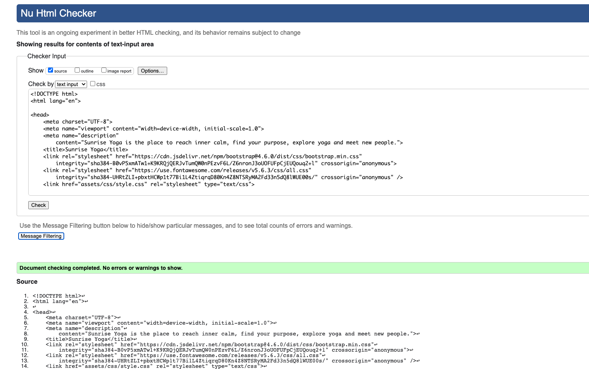

&nbsp;

- [The W3C CSS Validation Service](https://jigsaw.w3.org/css-validator/) tool was used to validate the CSS stylesheet. 

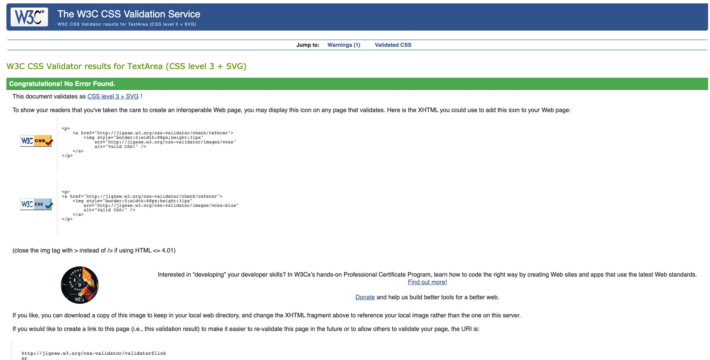

&nbsp;

### User Stories

1. *As a first-time visitor, I want to understand what the site is about and who it is for.*
&nbsp;
- The name Sunrise Yoga immediately indicates the site is related to yoga.
- The landing page has a hero image of a woman practicing yoga.
- On the landing page there is a welcome message, which explains who Sunrise Yoga is, what they offer and who their site is aimed at.
- At the end of the welcome page, there is link to the Get Started page, where users can find more information on starting yoga.
- On the landing page there is information about Sunrise Yoga's story, ethos and commitment to users. This gives more context to who Sunrise Yoga is.

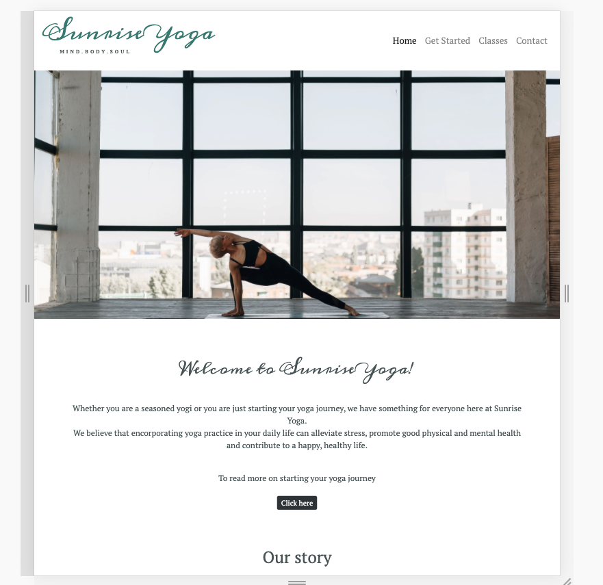

2. *As a first-time visitor, I want to be able to find information about yoga and the styles available, so I can decide if I want to attend.*
&nbsp;
- The Get Started page explains briefly what yoga is and what beginner options are available.
- The Classes page has information on the different styles available, what they are and their benefits. 
- Both pages can be accessed from the navigation bar, which remains at the top of the site, so users can find information quickly and easily.
   
   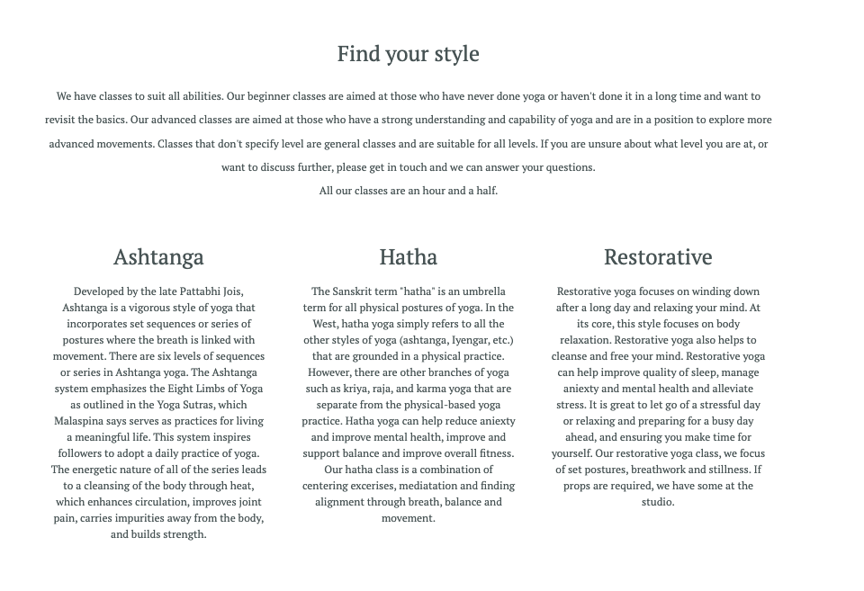

   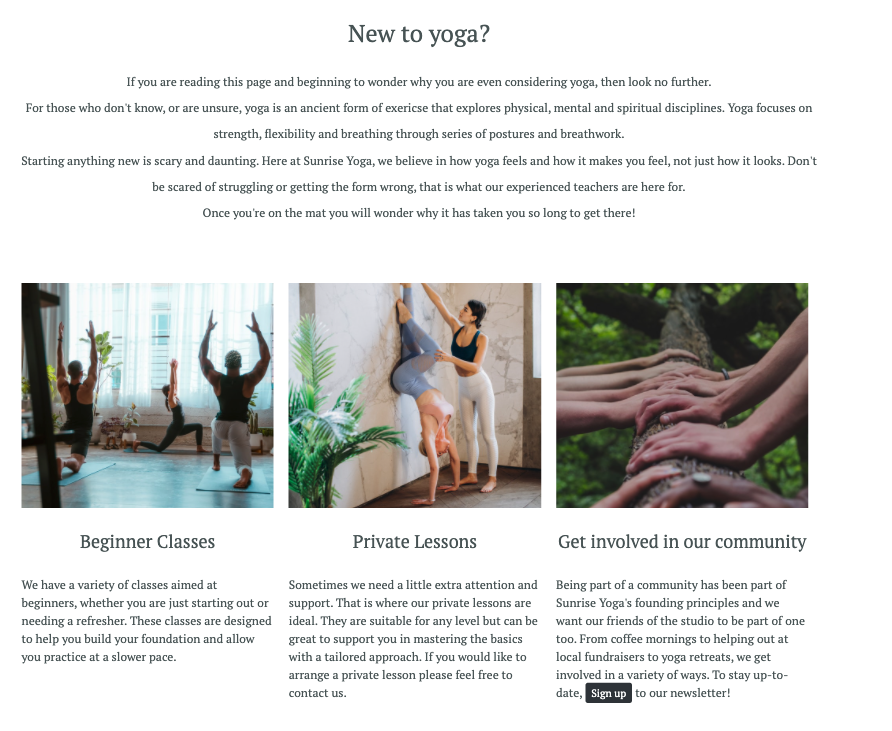

3. *As visitor, I want to be able to navigate the site easily, so I can find the information I seek.*
&nbsp;
- The navigation bar is sticky, and remains at the top of the site, so users do not have to scroll to the top to change page.
- On smaller screens the navigation bar collapses, with the menu dropdown button remaining in the top right hand of the screen.
- All pages are headed accordingly, so users know what page they are on.
- The page a user is presently on is highlighted in the menu, so users know which page they are on.

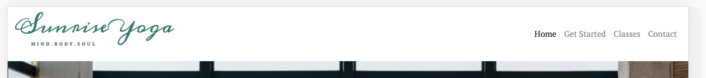

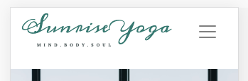

4. *As a visitor, I want to be able to check up-to-date class information, so I can find the right class for me.*
&nbsp;
- There is a dedicated classes page, which is clearly labelled in the navigation bar, so users can find the information easily.
- The class days and times are displayed in a table, so it can be easily read.
- On smaller screens the timetable is displayed in an accordion style, to ensure a good user experience.
- The yoga levels are indicated, with a short description of what they are beneath.
- The different types of yoga on offer is descbribed, so users understand the differences before they choose the right class.

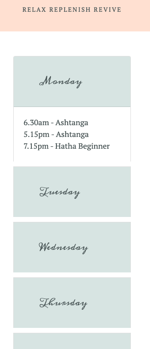

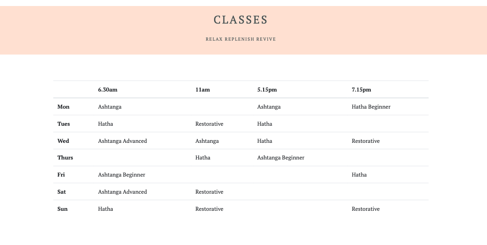

5. *As a visitor, I want to be able to contact the studio, so I can have my queries resolved.*
 &nbsp;
 - The contact page is clearly labelled in the navigation bar.
 - The contact form is clearly displayed and allows users to input their own message, rather than choose from pre-determined options.
 - The studio contact details are also displayed incase the user would prefer to contact the studio directly. 

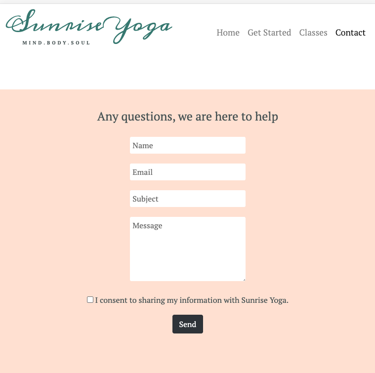

6. *As a visitor, I want to be able to sign up for a newsletter, so I can stay informed about the studio.*
&nbsp;
- There is a sign-up form on the landing page, which is clearly titled. 
- On the Get Started page, under the community section it encourages users to sign up to the newsletter. There is a button that links to the sign-up form below.

7. *As a visitor, I want to be able to find social media links, so I can continue to follow the studio.*
&nbsp;
- The social media links are displayed at the bottom of every page.
- Font Awesome icons have been used instead of text, as they are recognisable for users.

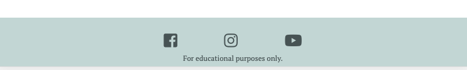

8. *As a visitor, I want to see images of the studio and classes, so I am encouraged to attend.*
&nbsp;
- Throughout the site images have been displayed.
- On the landing page there is a hero image and gallery.
- On the Get Started Page there are supporting images.
- There is a balance of images that convey a sense of the studio to the user, without overcrowding the site.

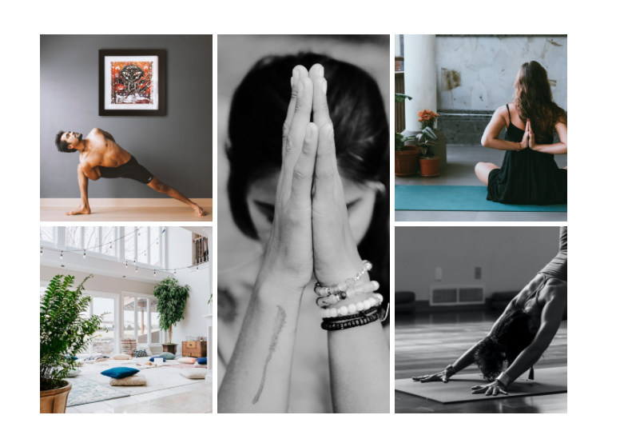

9.   *As a visitor, I want to know the location of the studio, so I can easily find it when I attend.*
&nbsp;
- On the contact page there is a brief description of the studio, a Google Map of the location and the studio address. 
- The location information is found on the contact page.

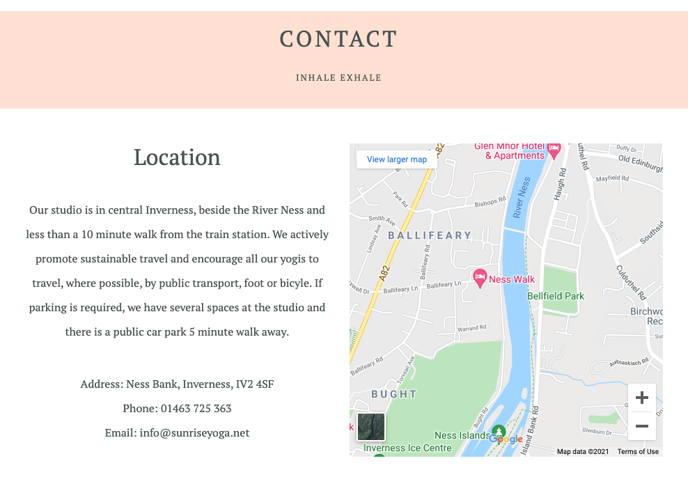

### Responsiveness

Responsiveness of this site has been tested using [Google Chrome Developer Tools](https://developer.chrome.com/docs/devtools/) and Safari Develop options. 

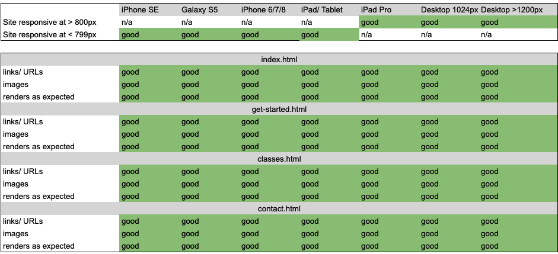

### Browser Compatibility 

The website was developed on Google Chrome 90.0.4430.212, and counter-checked with Safari 14.0.3.

Using [Lambdatest](https://www.lambdatest.com/) the site's browser compatibility was checked. 

The Lamdatest checked a selection of browsers and versions for both Windows and macOS.
- Chrome: 90, 89, 86, 85
- Firefox: 88, 87, 85, 84
- IE: 11
- Safari: 14, 13 

Below is an example of the browser compatibility tests.

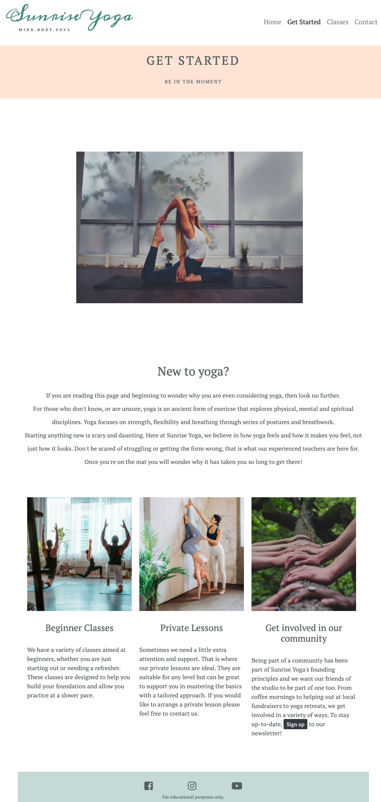

*Note: The site is compatible with different browsers. On IE some photos display minorly stretched but this does not affect the overall execution of the project.*

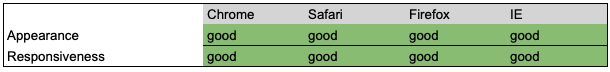

### Performance

To test the performance of the site Google Chrome Lighthouse was used. Each page was tested for performace, accessibility, best practice and search engine optimisation (SEO).

#### Home Page

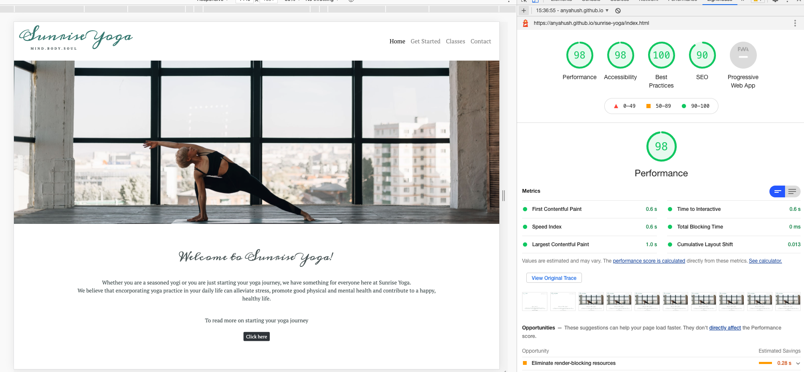

#### Get Started Page

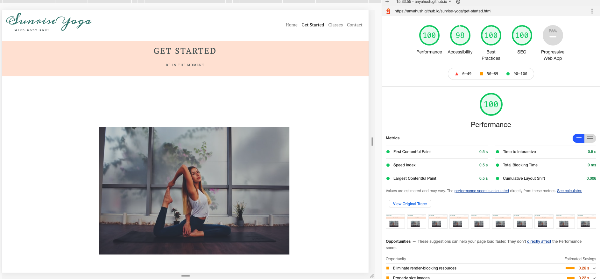

#### Classes Page

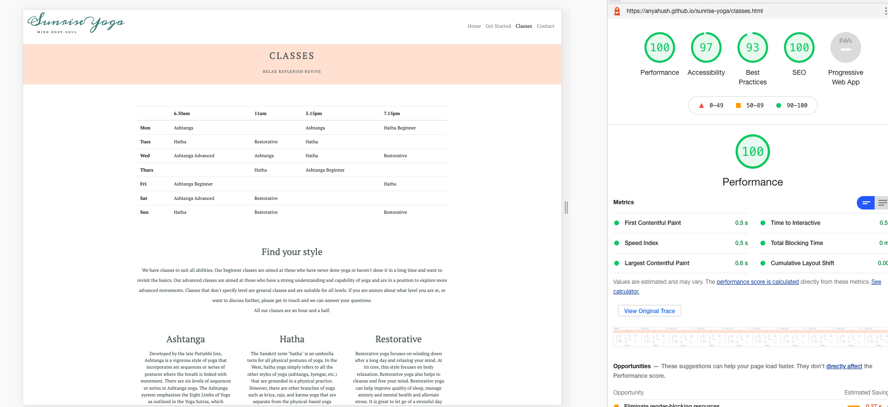

#### Contact Page
ß
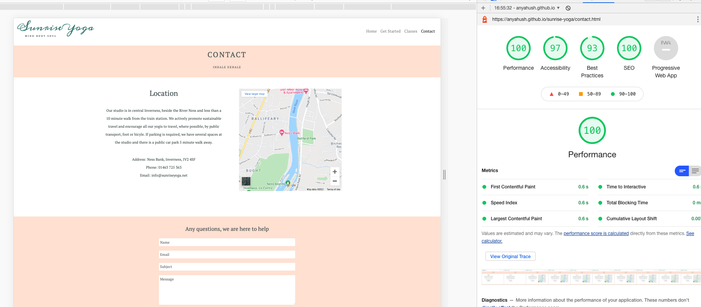

### Bugs

During development of this website several bugs arose and were subsequently fixed. 

1. Horizontal scrollbar
- A horizontal scrollbar appeared on the Get Started page. Width of images, containers and components were checked and initially the scrollbar was not resolved. After further investigation a Bootstrap offset class had been applied to the center image. After removing this, the scrollbar disappeared.

2. Spacing on Home Page
- On the home page there was an issue of spacing between the different 
 sections. When responsivness was checked the text overlapped. Media queries have been used to resolve this issue.

3. Navbar active highlight
- When on a different page other than the home page, the home page remained highlighted in the navbar. The active class has been added to each page to ensure when the user is on a page, that page is highlighted.

4. Required Attribute
- When trying to submit either the sign-up form or contact form, the form would not prompt the user if they had not filled in the required information. This has been rectified by changing the button types to submit and adding name attributes to the inputs.

5. Button on Home Page
- The "Click here" button at the end of the welcome message was sitting closely to the above text. As it is a Bootstrap styled anchor link, overriding the styles proved difficult. An additional line break has been included to ensure enough spacing around the button. 